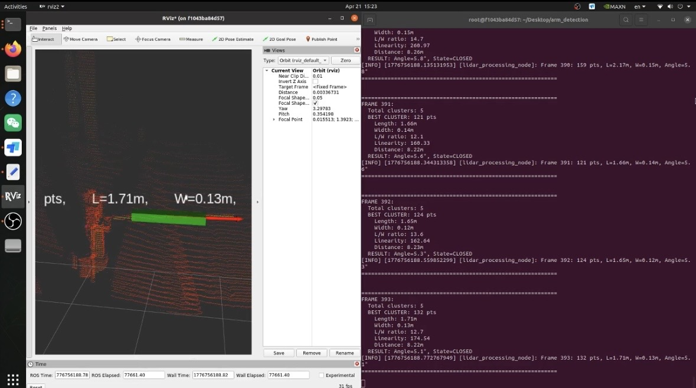
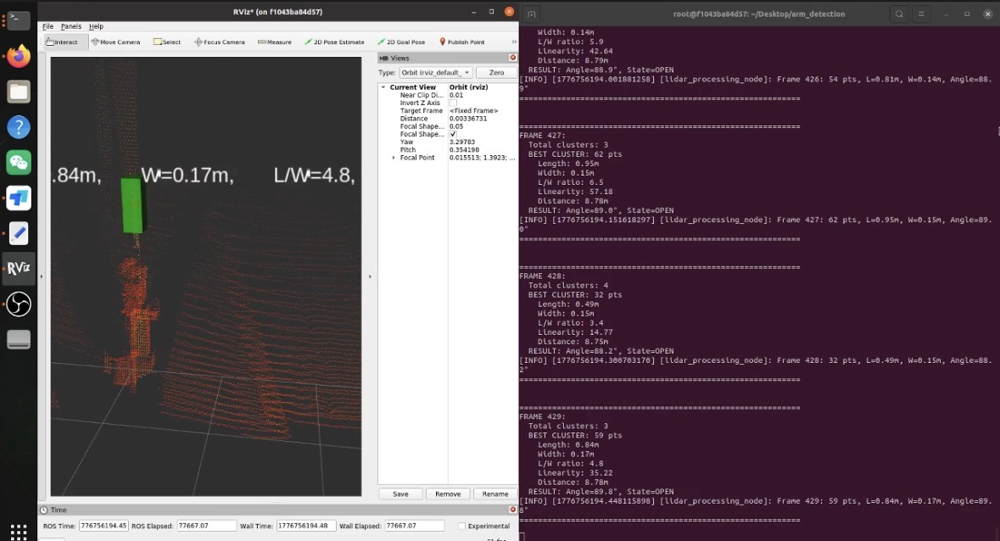
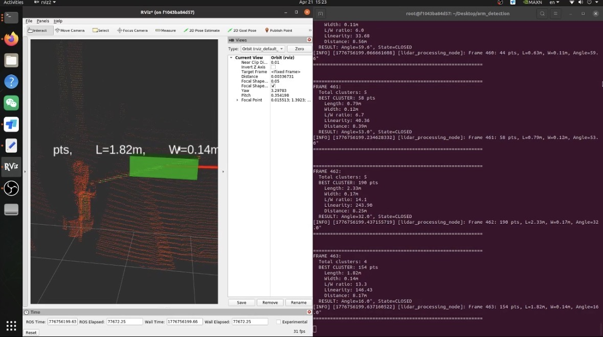

```markdown
# LiDAR Barrier Arm Detection

A ROS2 pipeline for real-time LiDAR-based barrier arm detection. Processes 3D 
point cloud data from a ROS2 bag using ROI cropping, statistical outlier removal, 
DBSCAN clustering, and PCA-based geometry to classify barrier arm state 
(OPEN/CLOSED) at 10 Hz.

LiDAR dataset can be found in this link - https://drive.google.com/drive/folders/1hwPxpl8aj0GkSstgmdUSosJ_4X74jQD6?usp=share_link.

Available in both Python (`alg_Python/`) and C++ (`alg_C++/`).





## 🚀 Quick Start

See the README inside each folder for full setup and build instructions:
- `alg_Python/README.md`
- `alg_C++/README.md`


## ⚙️ Detection Pipeline

1. ROI crop – focus on relevant region, remove ground
2. Outlier removal – clean noise from the point cloud
3. Voxel downsample – reduce density for performance
4. DBSCAN clustering – group points into candidate objects
5. PCA feature extraction – compute length, width, orientation
6. Best cluster selection – score by thinness and length
7. Classification – OPEN/CLOSED based on 80° angle threshold


## 📊 C++ vs Python Performance

Both implementations produce identical algorithm outputs and both achieve
the 10 Hz target, but differ significantly in speed.

| Metric            | C++            | Python  |
|-------------------|----------------|-------- |
| Data loading      | 4 sec          | 102 sec |
| Avg frame time    | 17 ms          | 88 ms   |
| FPS               | 10.00 Hz       | 9.98 Hz |
| Startup speedup   | 25x faster | –       |
| Per-frame speedup | 5x faster  | –       |

Algorithm outputs verified identical (same cluster, same angle, same state).

> C++ is recommended for production and embedded systems.  
> Python is recommended for prototyping and algorithm development.

## 🔧 Requirements

|         | Python                                  | C++               |
|---------|-----------------------------------------|-------------------|
| OS      | Ubuntu 22.04                            | Ubuntu 22.04      |
| ROS2    | Humble                                  | Humble            |
| Runtime | Python 3.8+, numpy, scikit-learn, scipy | PCL 1.10+, Eigen3 |

---

## License

Apache 2.0
